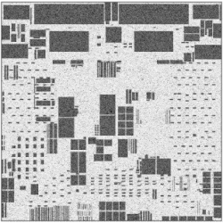
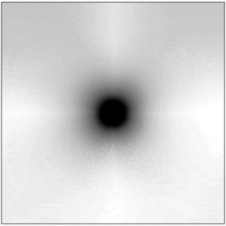
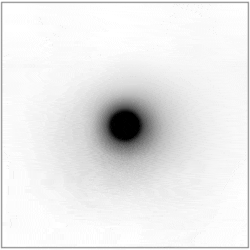

# DREAMPlace

Deep learning toolkit-enabled VLSI placement. 
With the analogy between nonlinear VLSI placement and deep learning training problem, this tool is developed with deep learning toolkit for flexibility and efficiency. 
The tool runs on both CPU and GPU. 
Over 30X speedup over the CPU implementation ([RePlAce](https://doi.org/10.1109/TCAD.2018.2859220)) is achieved in global placement and legalization on ISPD 2005 contest benchmarks with a Nvidia Tesla V100 GPU. 

DREAMPlace runs on both CPU and GPU. If it is installed on a machine without GPU, only CPU support will be enabled. 

| Bigblue4 | Density Map | Electric Potential | Electric Field |
| -------- | ----------- | ------------------ | -------------- |
|  |  |  |  |

# Publications

* [Yibo Lin](http://yibolin.com), Shounak Dhar, [Wuxi Li](http://wuxili.net), Haoxing Ren, Brucek Khailany and [David Z. Pan](http://users.ece.utexas.edu/~dpan), 
  "**DREAMPlace: Deep Learning Toolkit-Enabled GPU Acceleration for Modern VLSI Placement**", 
  ACM/IEEE Design Automation Conference (DAC), Las Vegas, NV, Jun 2-6, 2019
  ([preprint](http://yibolin.com/publications/papers/PLACE_DAC2019_Lin.pdf)) ([slides](http://yibolin.com/publications/papers/PLACE_DAC2019_Lin.slides.pptx))

# Dependency 

- Pytorch 0.4.1 or 1.0.0

- Python 2.7 or Python 3.5

- [GCC](https://gcc.gnu.org/)
    - Recommend GCC 5.1 or later. 
    - Other compilers may also work, but not tested. 

- [Boost](www.boost.org)
    - Need to install and visible for linking

- [Limbo](https://github.com/limbo018/Limbo)
    - Integrated as a git submodule

- [Flute](https://doi.org/10.1109/TCAD.2007.907068)
    - Integrated as a submodule

- [CUDA 9.1 or later](https://developer.nvidia.com/cuda-toolkit) (Optional)
    - If installed and found, GPU acceleration will be enabled. 
    - Otherwise, only CPU implementation is enabled. 

- GPU architecture compatibility 6.0 or later (Optional)
    - Code has been tested on GPUs with compute compatibility 6.0 and 7.0. 
    - Please check the [compatibility](https://developer.nvidia.com/cuda-gpus) of the GPU devices. 
    - The default compilation target is compatibility 6.0. 
    For compatibility 7.0, it is necessary to set the CMAKE_CUDA_FLAGS to -gencode=arch=compute_70,code=sm_70. 

- [Cairo](https://github.com/freedesktop/cairo) (Optional)
    - If installed and found, the plotting functions will be faster by using C/C++ implementation. 
    - Otherwise, python implementation is used. 

- [NTUPlace3](http://eda.ee.ntu.edu.tw/research.htm) (Optional)
    - If the binary is provided, it can be used to perform detailed placement 

To pull git submodules in the root directory
```
git submodule init
git submodule update
```

Or alternatively, pull all the submodules when cloning the repository. 
```
git clone --recursive https://github.com/limbo018/DREAMPlace.git
```

# How to Install Python Dependency 

Go to the root directory. 
```
pip install -r requirements.txt 
```

# How to Build 

[CMake](https://cmake.org) is adopted as the makefile system. 
To build, go to the root directory. 
```
mkdir build 
cd build 
cmake ..
make 
make install
```

Third party submodules are automatically built except for [Boost](www.boost.org).

To clean, go to the root directory. 
```
rm -r build
```

Here are the available options for CMake. 
- CMAKE_INSTALL_PREFIX: installation directory
    - Example ```cmake -DCMAKE_INSTALL_PREFIX=path/to/your/directory```
- CMAKE_CUDA_FLAGS: custom string for NVCC (default -gencode=arch=compute_60,code=sm_60)
    - Example ```cmake -DCMAKE_CUDA_FLAGS=-gencode=arch=compute_60,code=sm_60```
- CMAKE_CXX_ABI: 0|1 for the value of _GLIBCXX_USE_CXX11_ABI for C++ compiler, default is 0. 
    - Example ```cmake -DCMAKE_CXX_ABI=0```
    - It must be consistent with the _GLIBCXX_USE_CXX11_ABI for compling all the C++ dependencies, such as Boost and PyTorch. 
    - PyTorch in default is compiled with _GLIBCXX_USE_CXX11_ABI=0, but in a customized PyTorch environment, it might be compiled with _GLIBCXX_USE_CXX11_ABI=1. 

# How to Get Benchmarks

To get ISPD 2005 benchmarks, run the following script from the directory. 
```
python benchmarks/ispd2005.py
```

# How to Run

Before running, make sure the benchmarks have been downloaded and the python dependency packages have been installed. 
Go to the **install directory** and run with JSON configuration file for full placement.  
```
python dreamplace/Placer.py test/ispd2005/adaptec1.json
```

Test individual pytorch op with the unitest in the root directory. 
```
python unitest/ops/hpwl_unitest.py
```

# Configurations

Descriptions of options in JSON configuration file can be found by running the following command. 
```
python dreamplace/Placer.py --help
```

# Authors

* [Yibo Lin](http://yibolin.com), supervised by [David Z. Pan](http://users.ece.utexas.edu/~dpan), composed the initial release. 
